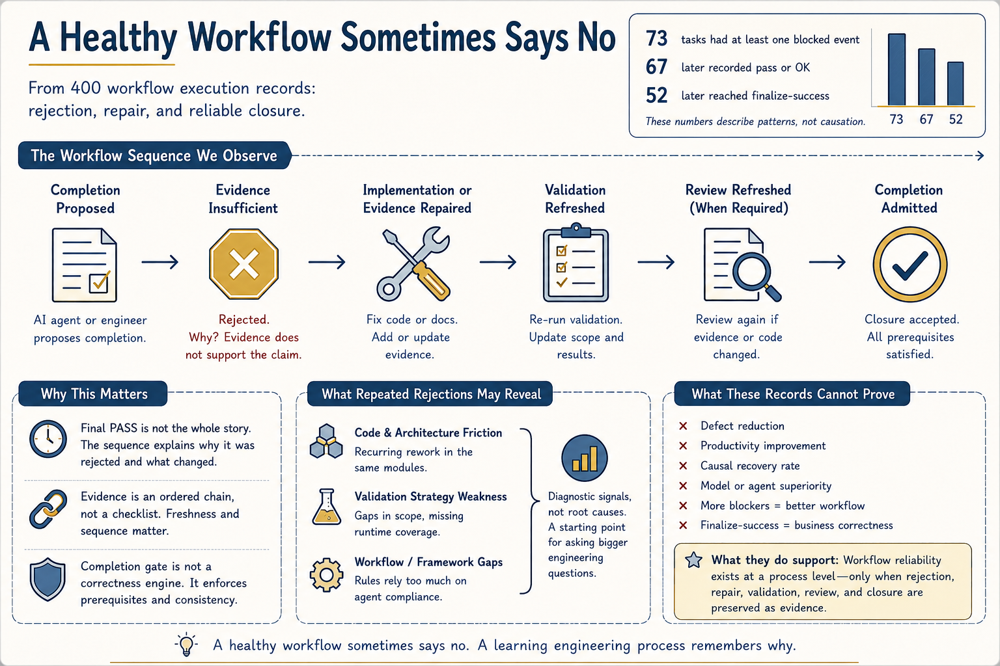

# A Healthy Workflow Sometimes Says No

In the previous article, I argued that completion needs evidence, not confidence.

The next question is simple:
What should a workflow do when the evidence is not enough?
It should refuse closure.

I reviewed 400 workflow execution records containing 2,983 task-local events across a workflow-governance repository and a hardware test-automation repository.

Among them:
 • 73 tasks contained at least one blocked event
 • 67 later recorded a pass or OK signal
 • 52 later reached finalize-success

These numbers do not prove defect reduction, and they do not show that every later fix directly resolved an earlier blocker.

They show something narrower:
Rejection, repair, renewed evidence, and eventual closure can be preserved as an observable workflow sequence.

A task may be blocked because validation does not cover the final change, review became stale, acceptance criteria remain unresolved, or the completion claim is stronger than the available evidence. In those cases, the workflow is not stopping progress. It is preventing insufficient evidence from becoming accepted engineering state. The final PASS is not the whole story.

A more useful record is:
completion proposed
 → evidence rejected
 → implementation or evidence repaired
 → validation refreshed
 → review refreshed when required
 → completion admitted

This matters because evidence is not just a checklist.
A validation result may exist and still be stale. A review may exist and still describe an earlier state. A completion record may exist and still be unsupported by the evidence that came before it. A completion gate is not a correctness engine. It cannot prove that every requirement was understood or every defect was found.

Its role is narrower:
 • required evidence exists
 • validation scope is recorded
 • review is current
 • blockers are resolved
 • workflow state is consistent

The engineer or agent may propose completion. The workflow decides whether that claim is admissible. One further observation emerged from the records. A single rejection trail explains one task.

Repeated rejection patterns may reveal something larger: weak validation scopes, incomplete task boundaries, recurring rework around the same modules, or workflow rules that depend too heavily on agent compliance.

These are diagnostic signals, not root-cause conclusions. But they may tell us where the codebase, validation strategy, or workflow framework needs attention next.

This observation also aligns with emerging research on verify-gated completion and process-level accountability in AI agent systems.

A healthy workflow sometimes says no.

A learning engineering process also remembers why.

hashtag#AIAssistedEngineering hashtag#SoftwareEngineering hashtag#WorkflowGovernance hashtag
