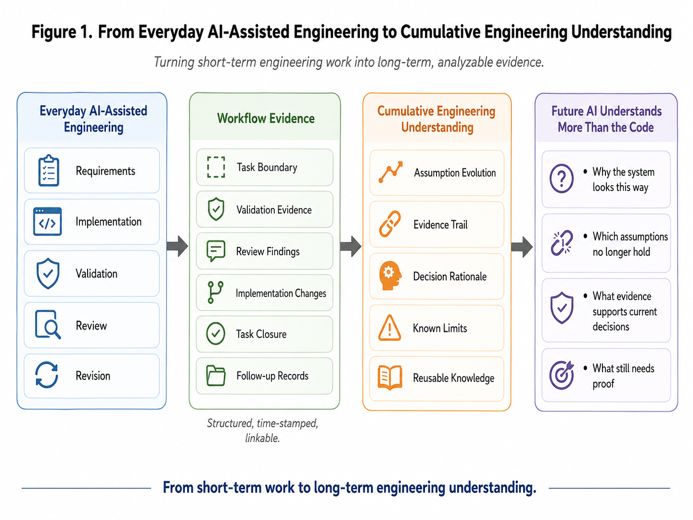
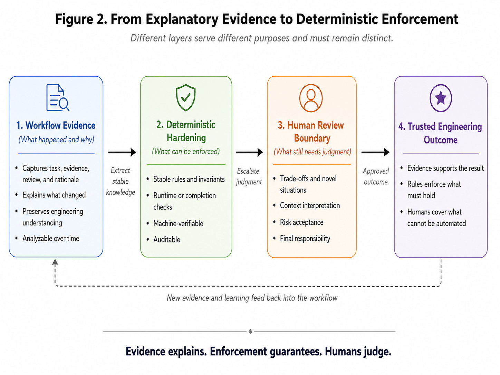

# AI-Assisted Engineering Needs More Than Long Context

## Why AI Must Understand How a Project’s Engineering Understanding Evolves

**Author:** Ruei Ming Deng  
**Date:** July 23, 2026

[Download the Publication Edition PDF](./AI_Assisted_Engineering_Needs_More_Than_Long_Context_Ruei_Ming_Deng.pdf)

---

AI’s ability to generate code is improving rapidly.

Today’s models can read repository-scale codebases, modify multiple files, generate tests, review implementations, call tools, and continue working across increasingly long interactions. For many teams, AI is no longer used only to generate isolated functions. It is beginning to participate in requirements interpretation, implementation, validation, diagnosis, review, and design revision.

A longitudinal survey of professional software engineers observed a related shift. Across two survey waves conducted six months apart, the study examined how engineers perceived AI coding assistants changing their task allocation, development experience, and productivity. Respondents generally reported spending less time writing code directly, while their work shifted from creation toward verification. The authors described this potentially emerging category of work as **supervisory engineering work**, including directing AI, evaluating its output, and making necessary adjustments.[1]

An important evidence boundary must be preserved: this study primarily reports engineers’ self-described perceptions and changes in work patterns. It is not an objective behavioral measurement based on IDE telemetry or independently recorded working time.

This changes the real question.

The question is no longer only:

> **Can AI generate code that works?**

It is also:

> **Can AI continue participating in a project whose engineering understanding evolves across weeks, months, and many development sessions?**

These are different problems.

Code generation asks whether a model can produce a plausible implementation.

Engineering requires a team to identify assumptions, collect evidence, interpret runtime behavior correctly, address review findings, preserve limitations, and decide whether the work has reached an evidence-supported state of completion.

Long context solves part of this problem. It allows an AI agent to inspect more of the current repository and retain more information from the present interaction.

But a larger context window does not automatically explain why the project arrived at its current engineering understanding.

That missing history matters.

---

## A Repository Preserves More Than Code

A software repository carries a large number of engineering assumptions.

Some assumptions remain valid for years. Others appear valid only because the initial environment is simple, the validation scope is narrow, or the system has not yet exposed a conflicting state.

As engineering continues, those assumptions encounter evidence.

A validation run reveals behavior the implementation did not anticipate.

An independent review identifies a missing condition.

A real system exposes a state transition that offline tests could not reproduce.

A multi-device or multi-controller environment invalidates an abstraction that looked safe at smaller scale.

When this happens, the code changes.

But the deeper change is not only in the code. The project’s **engineering understanding** has changed.

That understanding influences later decisions:

- which identities can be trusted;
- which states are actually safe;
- what evidence is sufficient;
- which targets must be bound explicitly rather than inferred by position;
- which judgments can be automated;
- and which decisions must remain under human responsibility.

For an experienced human team, some of this knowledge survives through repeated practice, discussion, and organizational memory.

For an AI agent entering a later session, much of it may be invisible.

The agent can inspect the current implementation without knowing which earlier assumptions were rejected, what evidence changed the design, or why a superficially simpler approach was abandoned.

---

## AI Often Sees the Result but Not the Path That Produced It

We repeatedly encountered this pattern in long-running enterprise storage engineering.

An early implementation treated a Linux device path as a stable storage identity. The assumption worked in simple environments. Later validation showed that device names could change with enumeration order, controller topology, or system state.

Engineering understanding therefore evolved from:

```text
Device Path
    ↓
Controller Identity and Explicit Ownership
```

In another case, successful cleanup was treated as evidence that the environment was immediately ready for the next destructive operation. Runtime behavior later showed that resource deletion and recovery to a safe system state were not the same event.

Engineering understanding therefore evolved from:

```text
Cleanup Completed
    ↓
Recovery and Readiness Verified
```

Another task initially selected the first logical drive. In early environments, where only one logical drive usually existed, that approach appeared sufficient. As the test environment became more realistic, the assumption no longer held.

Engineering understanding therefore evolved from:

```text
First Logical Drive
    ↓
Exact Logical-Device Binding
```

These examples first describe task content and domain context. They do not, by themselves, prove that any workflow-governance mechanism is effective.

Direct evidence of workflow capability comes from the artifacts surrounding the work: the task boundary, validation record, review findings, implementation revisions, completion decision, and later follow-up records.

This distinction is important.

Complex storage tasks provide strong pressure-test contexts, but they do not directly prove workflow capability. Workflow capability must be assessed from the evidence trail showing how the task was governed.

What these examples demonstrate is the kind of knowledge that can disappear when a project preserves only the final implementation.

The final code preserves what the project learned.

It does not necessarily preserve how the project learned it.

---

## Long Context Is Not Long-Term Engineering Understanding

Large context windows are valuable.

Repository retrieval, persistent memory, context compression, and structured workspaces are also valuable. Recent research on long-horizon software-engineering agents already treats context management as an engineering problem that an agent must actively handle, rather than as a matter of continuously appending more tokens. *Context as a Tool* argues that long interactions can produce context explosion, semantic drift, and degraded reasoning, and proposes a structured workspace containing stable task semantics, compressed long-term memory, and high-fidelity recent interaction.[2]

Research on self-compacting agents observes a related problem from another direction: long agent traces accumulate stale content, while compression triggered by a fixed token threshold can discard partial results while a derivation or search is still in progress. The study allows the model to decide when and how to compact its context according to a lightweight rubric, and evaluates the approach on competitive mathematics and agentic-search benchmarks.[3]

This is not direct evidence from repository-level software-engineering agents, so its results should not be generalized into a conclusion about software-engineering workflows. It supports a narrower adjacent observation: a long-running agent scaffold must manage not only whether compression occurs, but when and how it occurs.

These studies strengthen the case for active context management.

But they do not solve the complete engineering problem.

A later AI session may see only:

```text
Use controller-based device identity.
```

What it may not see is:

```text
Device Path Treated as Identity
        ↓
Validation in a More Complex Topology
        ↓
Device Mapping Proved Unstable
        ↓
Ownership Model Re-Reviewed
        ↓
Controller-Based Identity Adopted
```

The final rule tells the AI what the project does now.

The evidence path explains why an alternative that still appears reasonable should not be reintroduced.

Without that path, the AI may independently reconstruct an earlier assumption. This is not necessarily a memory failure in the usual sense. The model may never have been given access to the evidence on which the current design depends.

The missing element is therefore not only more context.

It is durable access to **how engineering understanding changed**.

---

## Git Preserves Implementation History, but Not the Full Engineering Basis

Git is indispensable.

It records which files changed, how implementations evolved, and when those changes were committed. Commit messages, issues, and pull-request discussions may also preserve parts of the rationale.

But engineering understanding is often distributed across many artifacts:

- task definitions;
- validation output;
- runtime logs;
- review findings;
- abandoned approaches;
- later follow-up work;
- environmental constraints;
- and evidence that appeared only after the original task was closed.

A diff can show that a helper changed from selecting the first logical drive to binding a specific identifier.

It may not explain that the earlier assumption failed only when multiple logical drives were introduced.

A commit can show that cleanup logic became stricter.

It may not preserve the runtime evidence demonstrating that resource deletion did not mean the environment was ready again.

This is not a criticism of Git. Git is doing what it was designed to do: preserve implementation history.

A related long-term knowledge problem also appears in software-engineering research. *From Papers to Progress* argues that when claims, evidence, context, and provenance are buried inside isolated narrative artifacts, knowledge becomes difficult to compare, trace, and reuse over time. The authors therefore propose a structured, interpretable, provenance-aware, and long-lived knowledge substrate.[4]

That paper studies software-engineering research artifacts rather than coding-agent workflows, so it does not directly demonstrate that the workflow design discussed here is effective.

It does, however, offer a useful structural analogy:

> A final artifact is not the same as accumulated knowledge.

Source history and engineering-evidence history are complementary.

Neither can replace the other.

---

## Workflow Evidence Accumulated Naturally from Everyday Engineering

We did not originally set out to build an AI research dataset.

We use AI agents in day-to-day engineering. To make AI-assisted work reviewable, we also use a lightweight, repository-native, deterministic workflow-governance layer.

Its objective is practical: to keep the following elements explicit:

- task boundaries;
- expected results;
- validation evidence;
- review findings;
- workflow state;
- unresolved limitations;
- and the conditions that must be satisfied before work is considered complete.

This workflow layer is not a coding agent.

It does not perform the engineering work, replace Git, act as continuous integration, run the domain test environment, or use a model to infer engineering conclusions automatically.

It governs the evidence and state surrounding AI-assisted work.

As tasks progressed, each piece of work naturally produced a workflow execution record:

```text
Task Intent
    ↓
Implementation
    ↓
Validation
    ↓
Review
    ↓
Revision
    ↓
Completion Decision
```

Over time, these records covered real engineering work.

They included successful tasks, blocked tasks, review-driven redesign, validation failures, bounded outcomes, follow-up tasks, and work intentionally left open because the evidence was not yet sufficient.

The records were originally created to support reviewability and completion governance.

Later, they also acquired another kind of value:

> They became an observation window into how engineering understanding evolves during AI-assisted development.

The public AIWF repository contains the implementation and design documents for this governance layer.[P1] The complete longitudinal execution records remain private because they include internal engineering and hardware-validation information. The observations in this article should therefore be understood as **early dogfooding records and engineering observations**, not as a public benchmark or a controlled demonstration of reliability improvement.

<figure class="full-page-figure figure-one">

<figcaption>Figure 1. Everyday AI-assisted engineering produces structured workflow evidence that can accumulate into durable engineering understanding.</figcaption>
</figure>

---

## What Workflow Records Make Visible

The final code shows the current implementation.

A workflow evidence trail can preserve the relationship among:

- the original task expectation;
- the assumption behind the first implementation;
- the validation result that challenged that assumption;
- the review finding that changed the design;
- the implementation revision;
- the evidence used to accept the revised result;
- and the limitations that remained after closure.

For example, a useful record does not merely state:

> Device matching logic was modified.

It can establish the following chain:

```text
Task Requires Stable Device Identification
        ↓
Validation Shows Paths Are Unstable
        ↓
Review Rejects Path-Based Matching
        ↓
Implementation Moves to Controller Ownership
        ↓
Regression Coverage Added
        ↓
Closure Based on New Evidence
```

This creates a relationship among task intent, system evidence, engineering interpretation, implementation change, and completion.

It also preserves an important distinction:

- **Historical Task Closure**
- **Current Effective Implementation State**

A task may have been closed correctly based on the evidence available at the time. New evidence can still change the implementation or narrow the earlier conclusion.

Historical closure remains valid because it records what was known and what decision was justified at that time.

But it should not automatically be treated as the final statement of current engineering truth.

This matters in long-running AI-assisted projects because a future AI agent must understand both:

1. why an earlier task could reasonably be closed at the time; and
2. why the project later moved beyond that result.

Without both views, the agent may misread history. It may reintroduce an outdated assumption, or it may treat an earlier bounded conclusion as if it had never been valid at all.

---

## An Action Trace Is Not Yet an Evidence Structure

It is tempting to assume that preserving the complete agent trajectory solves the problem.

It does not.

A complete tool history records what the agent did, but it does not automatically establish which observation supports which claim.

TRACER describes this as a **provenance gap**: a tool-using agent may provide both an action trajectory and a final answer without explaining the dependency between individual claims and the observations supporting them. Useful evidence, redundant exploration, and unsupported reasoning can remain mixed together in the same trace.[5]

That work studies multimodal tool-using agents rather than software-engineering workflow governance, so its conclusions should not be transferred directly to AIWF.

But the distinction is important:

```text
Action History
    ≠
Claim-to-Evidence Structure
```

In engineering, preserving every tool call is less important than preserving the evidence relationships that changed engineering understanding.

A long transcript may show that a test was run.

A useful engineering record must also explain:

- what the test was intended to establish;
- what scope it actually covered;
- what was observed;
- how the result changed the conclusion;
- and what remained unverified.

The value of workflow execution records therefore does not come merely from their being logs.

Their deeper value depends on whether they impose structure on the relationship between engineering claims and engineering evidence.

---

## Stored Guidance Is Not the Same as Applied Guidance

Even if a project successfully preserves earlier engineering knowledge, a later agent may not act on it.

TRACE studies this problem in a narrower but relevant setting: previously saved user preferences can be retrieved from memory, yet a coding agent may still violate the applicable requirement. The system therefore rewrites selected user feedback into atomic rules and compiles them into runtime checks that must pass before the task can terminate.[6]

TRACE studies preference access and preference compliance, not complex domain-level engineering understanding. It does not demonstrate that storage topology, identity semantics, recovery state, or other complex engineering knowledge should all be compiled automatically into rules.

The inference made here is narrower: **preserving engineering knowledge, retrieving it, and having it reliably shape a later implementation are three different problems.**

```text
Knowledge Stored
    ≠
Knowledge Retrieved
    ≠
Knowledge Reliably Applied
```

Repository-level instruction files also have limits. A study of AGENTS.md and similar repository context files found that agents generally followed the instructions and performed more testing and broader file exploration. However, the files did not produce a statistically significant improvement in task success, the results trended downward overall, and average inference cost increased by more than 20 percent. The authors therefore recommend that human-written context files focus on specific and necessary requirements that the repository itself cannot directly provide.[7]

This rules out an overly simple solution:

> Put the entire engineering history into the next prompt.

That approach is likely to create a different set of problems: too many instructions, stale constraints, conflicting guidance, and higher reasoning cost.

The real design problem is selective:

> Which established engineering understanding should remain explanatory evidence, and which should become operational control?

Some knowledge belongs in:

- design documents;
- workflow evidence;
- known limitations;
- review guidance;
- or explicit human decision boundaries.

Other knowledge, once stable, observable, and mechanically verifiable, may be appropriate for:

- regression tests;
- schema constraints;
- readiness checks;
- runtime guards;
- completion gates.

ZORO explores an adjacent direction: converting passive repository rules into active controls tied to planning and implementation, while requiring the agent to provide evidence that the rules were followed.[8] Its technical evaluation supports a bounded conclusion: in the study’s evaluation setting, active rule mechanisms improved rule following.

The boundary emphasized here is separate: a rule being followed, or an agent providing rule evidence, does not automatically prove that the rule itself is correct or that the underlying domain-level engineering claim is valid. That is a design inference made in this article, not a conclusion already established by ZORO.

Not every engineering decision can or should be compiled.

Deterministic control works best for stable, observable conditions that can be checked mechanically.

When evidence interpretation, risk acceptance, or domain judgment cannot be reduced safely to a check, human review remains indispensable.

<figure class="full-page-figure figure-two">

<figcaption>Figure 2. Explanatory evidence, deterministic hardening, and human judgment serve distinct but complementary roles.</figcaption>
</figure>

---

## Why This Matters More in the Age of AI

Human teams also lose context.

New maintainers reintroduce old designs. Documents become stale. The reasoning behind defensive implementations disappears when the original engineers leave.

This problem existed before AI.

AI changes its scale and speed.

An AI agent can generate modifications faster than a human engineer. It can also reconstruct a plausible but outdated understanding of the system very quickly.

When a repository exposes the current rule but not the evidence that established it, the agent may confidently propose an earlier approach again.

The real cost is not merely another generated patch.

The engineering team must repeat the work needed to re-establish the understanding:

- identify the hidden old assumption;
- reconstruct the relevant environment;
- locate or reproduce the evidence;
- explain why the alternative failed;
- revise the implementation;
- run validation again;
- review the new result.

As code generation becomes cheaper, repeatedly reconstructing engineering understanding that the project has already established may consume a growing share of the real engineering cost.

This is also why supervisory engineering matters. Engineers are not merely checking syntax. They are maintaining continuity between the project’s accumulated evidence and the agent’s current action.

AI-assisted engineering therefore needs to help later sessions distinguish among:

- an unexplored alternative;
- an outdated assumption;
- a known limitation;
- a conclusion that was valid historically but later superseded;
- a rejected design;
- and the current evidence-supported engineering position.

Long context does not create these distinctions automatically.

A structured engineering evidence trail can.

---

## What the Current Evidence Supports—and What It Does Not

Internal AIWF records support several bounded observations:

- workflow execution records can preserve relationships among task, validation, review, and completion;
- deterministic gates can expose missing or inconsistent workflow state;
- later records can show that the current implementation state differs from historical task closure;
- recurring engineering patterns across multiple tasks can be studied longitudinally;
- task content and workflow capability must be analyzed separately.

The current evidence does **not** support claims that:

- AIWF improved productivity by a specific percentage;
- AIWF reduced defects by a specific percentage;
- AIWF guarantees implementation correctness;
- one model is generally more reliable than another;
- every form of engineering understanding can be represented in a workflow record;
- all workflow knowledge should become deterministic enforcement.

The current observations are a starting point for reliability-dataset construction, not a completed benchmark.

Important evidence gaps also remain.

AIWF execution records are workflow-evidence records, not complete raw agent traces. They cannot always show exactly what the model attended to, whether a specific prompt sentence changed the model’s internal reasoning, or why the model selected a particular implementation.

These records are best suited to workflow questions:

- Was the task boundary explicit?
- Was validation recorded?
- Was the review still valid?
- Were blockers preserved?
- Was closure supported by evidence?
- Did later work change the effective state?

They should not be used casually to make causal claims about model cognition.

That boundary must remain explicit.

---

## Long Context Remains Essential

This article is not an argument against long context.

Large context windows are valuable.

Repository retrieval is valuable.

Persistent memory and structured context management are valuable.

They allow an AI agent to access more project information and reduce the cost of rediscovering basic repository structure in every session.

The point is that memory architecture alone cannot decide what a project should preserve.

If the evidence that changed an engineering decision was never recorded, no retrieval mechanism can reconstruct it reliably later.

If only the final implementation remains, a larger context window may simply allow the AI to inspect more of the final implementation.

It still may not know why the implementation had to take its current form.

Engineering environments therefore need several complementary forms of history:

```text
Source Code
    → Current Implementation

Git History
    → Implementation Evolution

Workflow Evidence
    → Basis for Validation, Review, and Completion

Operational Controls
    → Stable Knowledge Enforced Selectively by Machine
```

None of these replaces the others.

Together, they create a more durable foundation for AI-assisted engineering.

---

## AI Must Understand How the Project Learned

The next stage of AI-assisted engineering will not be determined only by models that can read more code.

It will also depend on whether engineering environments preserve the evidence behind evolving decisions.

Source code tells an AI agent how the system works today.

Git shows how the implementation changed.

Workflow evidence can show why the project’s engineering understanding changed.

Deterministic checks can preserve conclusions that have become stable and should no longer depend on repeated explanation.

Human review remains responsible for judgments that cannot be reduced safely to rules.

The goal is not to make AI remember every conversation.

The goal is to prevent every new AI session from reconstructing engineering understanding that the project has already established.

Long context helps AI understand today’s repository.

Engineering evidence helps AI understand how today’s repository came to be.

When AI participates in an engineering project that lasts longer than a single session, it needs to understand more than the current code.

It must also understand how the project learned why that code became necessary.

---

## Disclosure and Evidence Boundary

The engineering examples in this article are generalized from private AIWF dogfooding execution records. These records were produced during AI-assisted enterprise-storage automation work and AIWF’s own development. Task names, repository paths, raw logs, product-sensitive information, and internal diagnostic identifiers have been omitted.

The public AIWF repository contains the workflow-governance implementation and design documents, but not the complete private execution-record dataset. This article should therefore be read as an evidence-backed engineering argument and an early longitudinal observation—not as a public benchmark or proof of causal reliability improvement.

Public repository: <https://github.com/jackden/aiwf>

---

## Research References

> **Publication status note:** [1]–[3] and [5]–[8] are cited as arXiv preprints. [4] includes its formal ICSE-FoSE 2026 venue and DOI. When discussing preprints, the article uses language such as “the study observed,” “the experiments showed,” or “the authors proposed,” rather than presenting the findings as universally established engineering facts.

[1] Annie Vella and Kelly Blincoe. “The Impact of AI Coding Assistants on Software Engineering: A Longitudinal Study.” arXiv:2605.23135, 2026. <https://arxiv.org/abs/2605.23135>

[2] Shukai Liu, Jian Yang, Bo Jiang, Yizhi Li, Jinyang Guo, Xianglong Liu, and Bryan Dai. “Context as a Tool: Context Management for Long-Horizon SWE-Agents.” arXiv:2512.22087, 2025. <https://arxiv.org/abs/2512.22087>

[3] Tianjian Li, Jingyu Zhang, William Jurayj, Xi Wang, Chuanyang Jin, Mehrdad Farajtabar, Eric Nalisnick, and Daniel Khashabi. “Self-Compacting Language Model Agents.” arXiv:2606.23525, version 2, 2026. <https://arxiv.org/abs/2606.23525>

[4] Jason Cusati and Chris Brown. “From Papers to Progress: Rethinking Knowledge Accumulation in Software Engineering.” In *2026 IEEE/ACM 48th International Conference on Software Engineering: Future of Software Engineering (ICSE-FoSE)*, 2026. DOI: 10.1145/3793657.3793888. arXiv:2604.16208. <https://arxiv.org/abs/2604.16208>

[5] Bihui Yu, Caijun Jia, Jing Chi, Xiaohan Liu, Yining Wang, He Bai, Yuchen Liu, Jingxuan Wei, and Junnan Zhu. “TRACER: Verifiable Generative Provenance for Multimodal Tool-Using Agents.” arXiv:2605.09934, 2026. <https://arxiv.org/abs/2605.09934>

[6] Yujun Zhou, Kehan Guo, Haomin Zhuang, Xiangqi Wang, Yue Huang, Zhenwen Liang, Pin-Yu Chen, Tian Gao, Nuno Moniz, Nitesh V. Chawla, and Xiangliang Zhang. “Getting Better at Working With You: Compiling User Corrections into Runtime Enforcement for Coding Agents.” arXiv:2606.13174, 2026. <https://arxiv.org/abs/2606.13174>

[7] Thibaud Gloaguen, Niels Mündler, Mark Müller, Veselin Raychev, and Martin Vechev. “Evaluating AGENTS.md: Are Repository-Level Context Files Helpful for Coding Agents?” arXiv:2602.11988, 2026. <https://arxiv.org/abs/2602.11988>

[8] Jenny Ma, Sitong Wang, Joshua H. Kung, and Lydia B. Chilton. “ZORO: Active Rules for Reliable Vibe Coding.” arXiv:2604.15625, 2026. <https://arxiv.org/abs/2604.15625>

---

## Project Source

[P1] Jackden. “AIWF: Repository-native, lightweight deterministic workflow governance for AI-assisted engineering.” GitHub repository, public release v1.7.13.post1, accessed July 23, 2026. <https://github.com/jackden/aiwf>

[Download the Publication Edition PDF](./AI_Assisted_Engineering_Needs_More_Than_Long_Context_Ruei_Ming_Deng.pdf)
