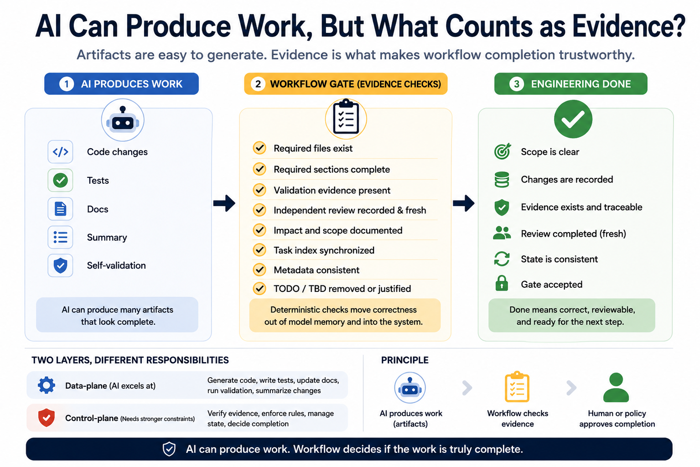

# AI Can Produce Work, But What Counts as Evidence?

AI assistants are becoming good at producing engineering artifacts: code patches, documentation, test notes, summaries, and review checklists. But in real engineering work, producing something is not the same as completing the workflow.

A patch may exist but not be validated. A review note may be stale. A task report may fail to explain why the task is acceptable. A model may say “done,” but that does not mean the workflow should move to a completed state.

One problem I keep seeing in AI-assisted engineering: generated artifacts are often treated as proof of progress. But an artifact is not evidence.

An artifact is what the system produced. Evidence is what allows someone else to verify why the workflow state changed.

If the workflow can show what changed, why it changed, how it was checked, and why the task was accepted, then we have evidence.

AI can produce artifacts that look complete even when the workflow behind them is incomplete. Output may be accepted before there is enough evidence.

Completion should not be a conversational conclusion from the model. It should be a guarded transition.

Not: “The AI said it is done.”

But: “The work exists, validation is present, review is fresh, and the final state is justified.”

This changes the goal of AI-assisted work. The goal is not only to produce more. The goal is to make AI-assisted work easier to verify.

For that, evidence needs a path.

A single file, summary, or review note is not always enough. The workflow needs to preserve the path from intent to implementation, validation, review, and completion.

Review is temporal. A review is not just a document. It is a statement made at a specific time, against a specific version of the work. If the work changes after review, it may no longer support completion.

Evidence is not only about existence. It is also about timing, relationship, and interpretation.

Good evidence should answer: What changed? Why did it change? How was it validated? Was the review after the final change? Can another person understand why the task was accepted?

Raw logs may help, but raw logs alone are not enough. Useful evidence should explain why an event mattered to the workflow.

The harder question is not whether AI can generate useful output. It is whether the workflow can decide when AI-generated work is ready to be accepted.

AI-assisted engineering does not only need better generation. It needs evidence-backed workflow transitions.

Producing work is one part of the process. Knowing when the work is complete is a different problem.

hashtag#AIEngineering hashtag#AIWorkflow hashtag#SoftwareEngineering hashtag#EngineeringWork
