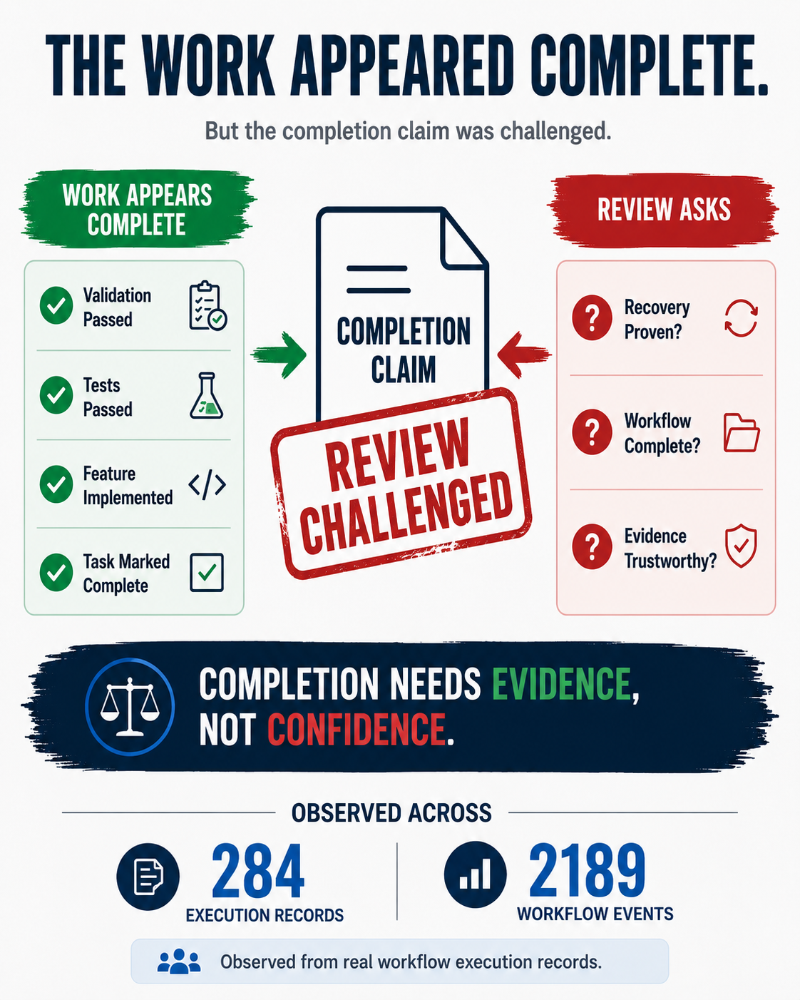

# Completion Needs Evidence, Not Confidence

Over the past few months, I have reviewed a growing collection of workflow execution records. At the time of writing, the dataset contains 284 execution records and 2189 workflow events. What surprised me was not how often implementations failed, but how often completion claims were challenged after the work appeared finished.

One example came from a Hot Spare automation task. From a functional perspective, the work looked complete. Validation passed, RAID creation worked, Hot Spare creation worked, fault injection worked, and rebuild behavior matched expectations. The review, however, focused on a different question. The existing validation demonstrated that the workflow could execute successfully, but it did not demonstrate that recovery-related states had fully converged before cleanup occurred. The task eventually required additional recovery checks and validation before closure.

A second example came from workflow execution itself. The records showed that code changes occurred before the corresponding task record was created. Later, incorrect dates, malformed metadata, and workflow artifacts requiring repair were discovered. The resulting code still functioned correctly, but part of the workflow context had become uncertain because the record was reconstructed after the work had already happened. The metadata validation, date guards, and deterministic metadata generation that followed were intended to improve the trustworthiness of the evidence trail.

These very different cases kept leading back to the same question: does the available evidence actually support the completion claim?

These records gradually changed how I think about completion. Code can be generated quickly. Test results can be produced quickly. Completion claims can be produced quickly. Building a trustworthy chain of evidence is usually much harder. A completion statement tells us what someone believed at a particular moment. The evidence tells us whether that belief can survive review.

As AI becomes more involved in engineering work, I suspect this distinction will become increasingly important. A completion claim is not the destination. The evidence behind the completion claim is.

### Further Reading

- [Beyond Task Success: An Evidence-Synthesis Framework for Evaluating, Governing, and Orchestrating Agentic AI](https://arxiv.org/abs/2604.19818)

- [Verify-Gated Completion as Admission Control in a Governed Multi-Agent Runtime: A Bounded Architecture Case Study](https://arxiv.org/abs/2605.17998)
