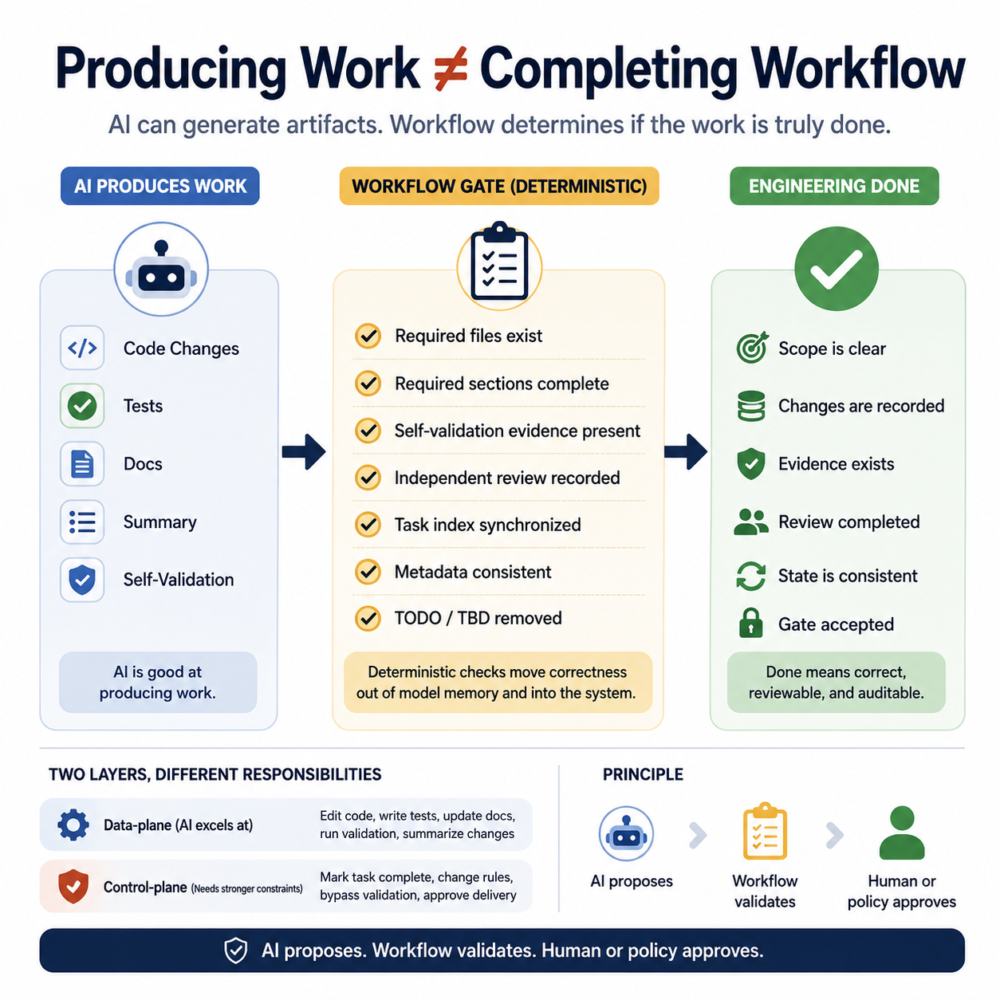

# Producing Work Is Not Completing Workflow

In the previous article, I described why this became obvious only after using AI repeatedly in real engineering work.

At first, the result looked good. AI could read code, propose a fix, update files, explain the change, and sometimes write tests. For a single task, that felt like real productivity.

But across multiple tasks, sessions, and reviews, a different problem appeared. The issue was usually not that AI could not write code. The workflow around the code slowly became unreliable.

In one task, the code change was done, but the task record was incomplete. In another, AI wrote a self-validation note, but the evidence was too weak. Sometimes a review file existed, but it summarized the change instead of reviewing the real risk. I also saw cases where a task was marked done, but the parent index or metadata was still stale.

That was the real lesson: AI can be good at producing work, but producing work is not the same as completing an engineering workflow.

In real software engineering, “done” means scope is clear, changes are recorded, validation evidence exists, review happened, task state is consistent, and an explicit gate accepted the result.

This is why I started experimenting with AIWF: a small deterministic control plane around AI-assisted engineering work.

The core idea is simple: AI can generate artifacts, but workflow state should be validated by deterministic rules. Before finalizing a task, the workflow can check whether required files exist, sections are complete, self-validation evidence is present, review is recorded, the task index is synchronized, metadata is consistent, and TODO/TBD placeholders are removed.

These checks are not exciting, but they matter. They move workflow correctness out of the model’s memory and into a visible system. That changes the role of AI: the model can write code, update tests, generate docs, summarize changes, and help with validation or review, but it should not be the only authority deciding that the work is complete.

One useful distinction is data-plane versus control-plane work. Data-plane work includes editing code, writing tests, updating docs, and running validation. Control-plane work includes marking a task complete, changing workflow rules, bypassing validation, and approving delivery.

AI can assist with both, but control-plane actions need stronger constraints. This matters even more with cheaper models, local models, or model routing. A reliable engineering workflow should not depend on the model always remembering every rule perfectly.

The process itself should carry state, expose missing evidence, and make it harder to say “done” when the workflow is not actually done.

My current principle is:

AI proposes.
Workflow validates.
Human or policy approves.

hashtag#AIEngineering hashtag#AgenticWorkflow hashtag#SoftwareEngineering hashtag#AIWorkflow hashtag#
