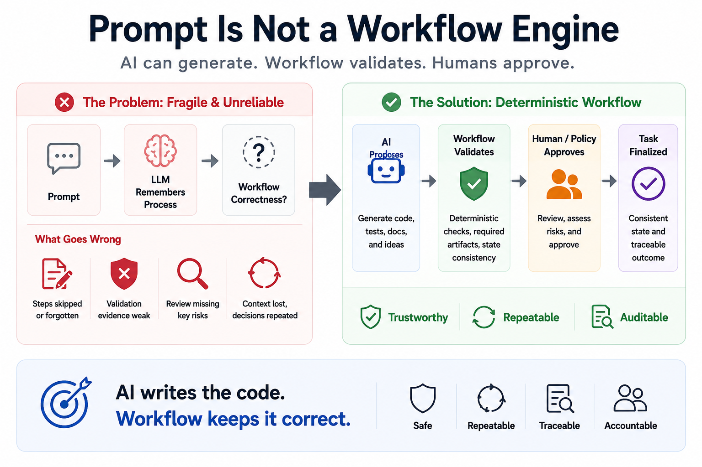

# Prompt Is Not a Workflow Engine

Recently, I have been experimenting with AI-assisted engineering workflows in real software projects.

At first, the approach looked familiar:

Better prompts.
More detailed AGENTS.md.
More checklists.
More instructions telling the AI to remember the process.

The implicit model was:

Prompt
↓
LLM remembers the process
↓
Workflow correctness

This works sometimes.

But after repeated use, the problems become visible.

The AI may change the code but forget to update the task record.
It may say validation passed without enough evidence.
It may generate a review document without reviewing the real risk.
It may mark a task as done while the index or metadata is still stale.
A later session may lose context and repeat or bypass earlier decisions.

These are not just prompt quality problems.

They are workflow governance problems.

The core issue is simple:

We are asking a probabilistic model to act as a deterministic process controller.

That is the wrong abstraction.

I now prefer a different model:

AI proposes
↓
Workflow validates
↓
Human approves

AI can write code, update tests, generate documents, and summarize validation.

But the final workflow state should not depend only on the model saying “Done.”

Required files should exist.
Required sections should be complete.
Metadata should be consistent.
The task index should be synchronized.
Validation evidence should be present.
The review gate should be explicit.

These checks should be deterministic.

I call this experiment AIWF:

A lightweight deterministic control plane for AI-assisted engineering.

It is not meant to be a heavy project management system.

The goal is to add just enough deterministic structure around AI work so task state becomes visible, auditable, and checkable.

This matters even more for cheaper models, local models, and smaller coding models.

Reliable AI engineering should not depend on the assumption that the model will always remember the process perfectly.

My current principle is:

AI generates.
Workflow validates.
Human or policy approves.

The real question is no longer only:

Can AI write the code?

The better question is:

Can AI participate in an engineering workflow that remains correct, reviewable, and trustworthy?

That is the problem worth solving.

hashtag#AIEngineering hashtag#AgenticWorkflow hashtag#SoftwareEngineering hashtag#AIWorkflow
