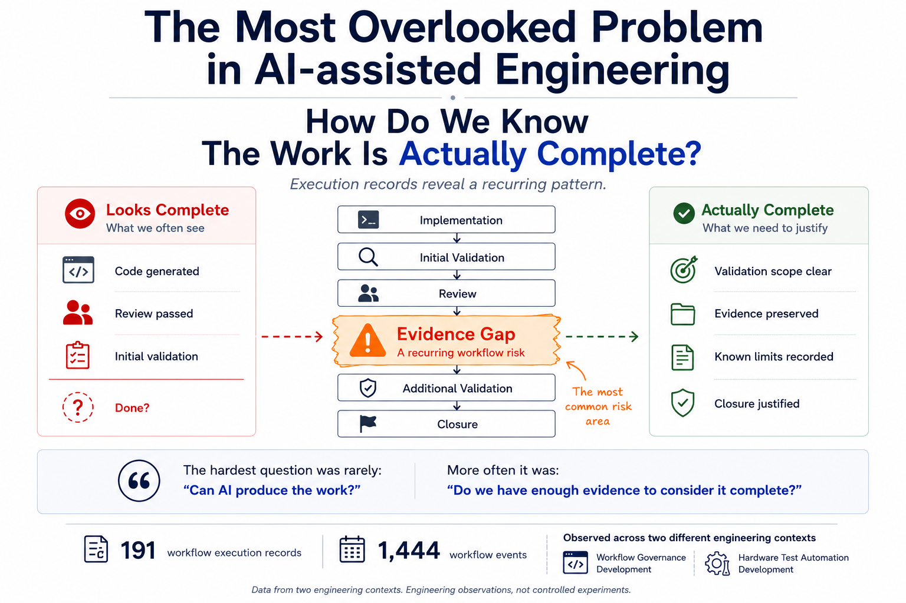

# The most overlooked problem in AI-assisted engineering

Over the past few months, I spent some time reviewing workflow execution records generated during real engineering work. Originally, I expected to learn more about prompting, model capability, or AI coding quality. Instead, I kept running into a much simpler question:

How do we know the work is actually complete?

Many tasks looked complete on the surface. The implementation existed, the review passed, and some level of validation had already been performed. From a project tracking perspective, everything looked ready to close. Yet the records repeatedly revealed the same thing: evidence gaps.

The interesting part was that these gaps were not always caused by implementation problems. More often they were caused by missing validation, incomplete artifacts, unclear assumptions, or unanswered questions. The code was there. The closure justification was not.

Another pattern appeared across different engineering activities. Many tasks ended with the same outcome:

 PASS

But the meaning behind those PASS states was often very different.

For example:
 ．review-only validation
 ．collect-only verification
 ．DUT validation
 ．destructive validation

All could eventually be labeled PASS. Yet they did not provide the same level of evidence. This led to an observation I did not expect. PASS tells us the outcome, but it does not necessarily tell us the validation scope.

The records analyzed for this observation included:

 ．191 workflow execution records
 ．1,444 workflow events
 ．186 validation records
 ．186 review records

Review outcomes included:

 ． PASS: 141
 ． PARTIAL: 17
 ． HOLD: 8
 ． FAIL: 2

The numbers themselves are not particularly important. What mattered was the pattern behind them.

Many follow-up tasks were not code fixes. They were evidence fixes.
Examples included:

．additional validation
．additional verification
．missing prerequisites
．missing artifacts
．clarification of assumptions

In other words, implementation was often not the bottleneck. Evidence was.

These records do not prove that AI produces better code, higher productivity, or that one workflow is universally superior to another. The evidence simply does not support those conclusions.

What the records do suggest is something much narrower. Across different engineering activities, completion claims repeatedly depended on evidence—not just implementation, not just review outcomes, but evidence.

That changed how I think about AI-assisted engineering.

The hardest question is often not:

 Can AI produce the work?

But:

 Do we have enough evidence to consider it complete?

Curious what others are seeing.

When work gets delayed in your environment, is it usually because implementation is missing? Or because the team is not yet comfortable saying:

 “We have enough evidence to close this.”

hashtag#AIEngineering hashtag#SoftwareEngineering hashtag#AICoding hashtag#EngineeringWorkflo
